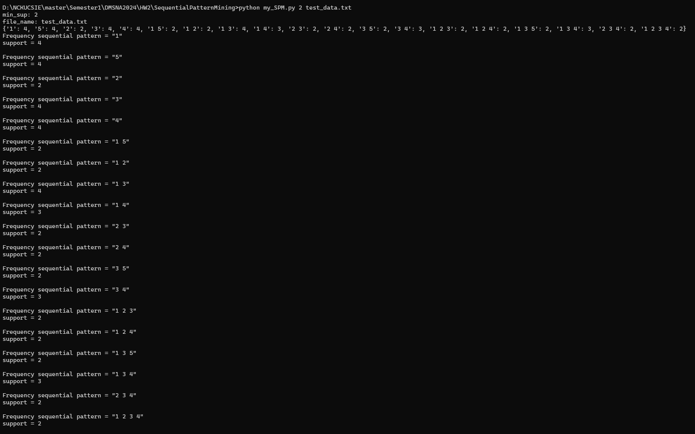
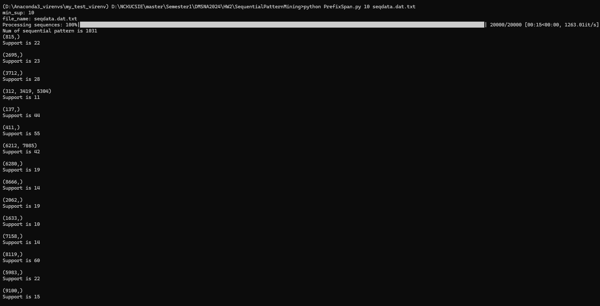

# SequentialPatternMining
## 說明
此專案有兩份可執行檔:
> my_SPM.py

> PrefixSpan.py

my_SPM是根據我們組在課堂上討論時提出的序列挖掘演算法實作而成的，算法說明在以下網址:https://docs.google.com/document/u/1/d/1JeBRA1EJ9VqNl2yn509WbKEDwDjs6loOMHkQSWigAeA/edit?usp=sharing
但此演算法由於在一開始在所有one item找兩兩一組排列並檢查support時會花費大量時間，因此只適用在小資料集，如資料夾中的test_data.txt(此檔案為老師上課投影片之範例測資)

而PrefixSpan.py就是實作PrefixSpan演算法
一個sequence中會包含一個或多個transaction，處於同個transaction的商品視為同時購買，為了處理這種情況，我將每一個transaction都進行representation編號，不管該筆transaction包含一個或多個商品，都將其編為不重複的單一編號，去進行prefixSpan，在最終輸出結果時再轉換回來
而由於我將每一個transaction都進行representation編號，不管該筆transaction包含一個或多個商品，都將其編為不重複的單一編號，因此整體的support會受到影響，例如某個商品只要不是單獨出現在一個transaction，而是與其他商品同時出現在一個transaction中，那就不會被算到support，這也是我在實作時遇到的狀況，因此我在執行程式時會將min_sup設低一點，例如10

## 執行方式
> python my_SPM.py min_sup 測資檔案名稱
例如:
> python my_SPM.py 2 test_data.txt
執行結果如下:

> python PrefixSpan.py 10 seqdata.dat.txt

